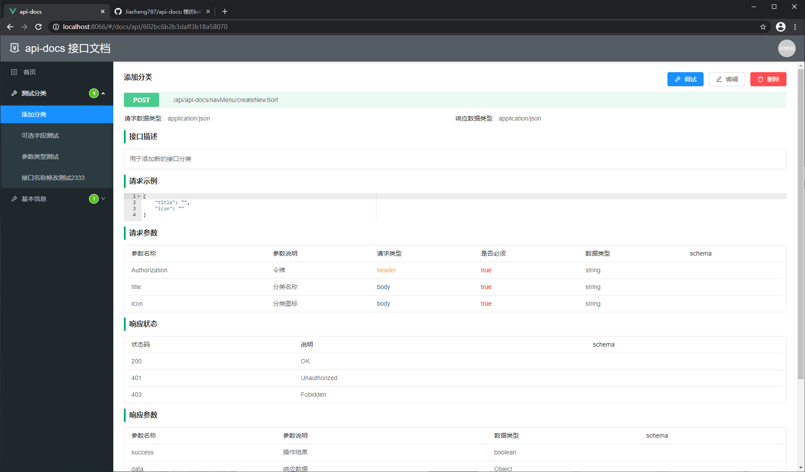
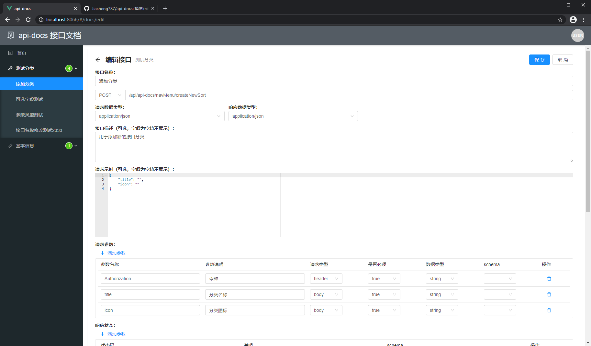
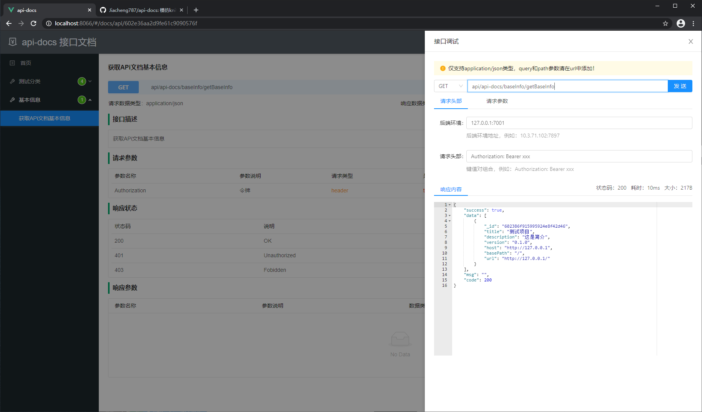

# api-docs 接口文档

🔥 模仿knife4j开发的接口文档项目，采用纯前端技术栈（Vue + egg.js）

api-docs-front 为前端项目

api-docs-backend 为后端项目

mongodb 为测试用的数据（不推荐导入数据进行测试）


## 主要技术栈

前端技术栈：

Vue2.6，vue-router，vuex，ant-design-vue，vue2-ace-editor

后端技术栈：

egg.js，mongoDB，mongoose.js (ORM)，urllib (HttpClient)

数据库可视化：

MongoDB Compass


## 运行项目

1. 安装 mongodb ，创建 `api_details` 数据库，创建三个 collection ：`api_details` ，`base_info` ，`nav_menu` 

2. 安装 node.js（本人开发的版本：node v12.16.1，npm 6.13.4），分别进入前端和后端项目根目录，执行下面的命令安装依赖

   ```bash
   $ npm install
   ```

3. 本地启动开发服务器（确保 mongodb 服务已经启动）

   ```bash
   # 后端项目（7001端口）
   $ npm run dev
   # 前端项目（8066端口）
   $ npm run serve
   ```

   > 前端项目 webpack-dev-server 已经设置了代理，本地运行不用担心跨域问题

4. 生产环境部署

   前端项目打包：

   ```bash
   $ npm run build
   ```

   后端项目启动（不用打包）：

   ```bash
   $ npm start
   ```

   nginx 配置：

   ```
   location / {
   	root    /root/workspace/api-docs/dist;
   	index index.html index.htm;
   }
   location /prod-api/ {
   	proxy_set_header Host $http_host;
   	proxy_set_header X-Real-IP $remote_addr;
   	proxy_set_header REMOTE-HOST $remote_addr;
   	proxy_set_header X-Forwarded-For $proxy_add_x_forwarded_for;
   	proxy_pass http://127.0.0.1:7001/;
   }
   ```


## 项目截图

项目首页：https://github.com/Jiacheng787/api-docs/blob/main/img/image-20210220173819528.png


添加接口：


接口详情：



接口编辑：



接口调试：


